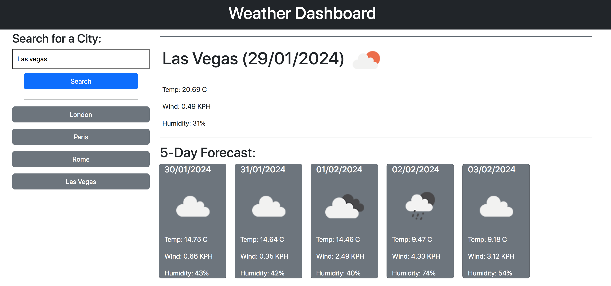

# Weather-Dashboard

# Description
This project used starter HTML code and was developed using CSS and Javascript. To support the styling of the webpage, Bootstrap was integrated into the code. JQuery was used in the javascript file to support the creation of elements and enable them to be appended to the HTML file. Day.js was also used to format the date displayed on the webpage. Finally, the weather data shown on the webpage was fetched from the open weather api. The aim of this project was to create a weather dashboard that displayed the current weather conditions aswell as the forecast for the next 5 days to enable users to plan their travels around the weather conditions. 

# Installation
N/A

# Usage
To use this webpage the user must input a city name into the search bar and click the search button. Once the button is clicked a box will appear on the right of the screen displaying the current weather conditions for the city inputted into the search bar. Below that 5 cards will also appear displaying the weather conditions for the next five days in that city. Alongside this the city name will be stored as a button below the search bar. Each time a new city is entered a button will be created and the data will be stored in the local storage. When the user clicks a button the weather data for that city will be retrieved from the local storage and redisplayed on the screen.

To access the webpage click this link: https://embow24.github.io/Weather-Dashboard/ 

Below is a screenshot of the weather dashboard:

# Credits
Had support from a tutor to explain local storage and how to add it to my code so that the data stored and retrieved when the city named button was clicked.

# License
MIT